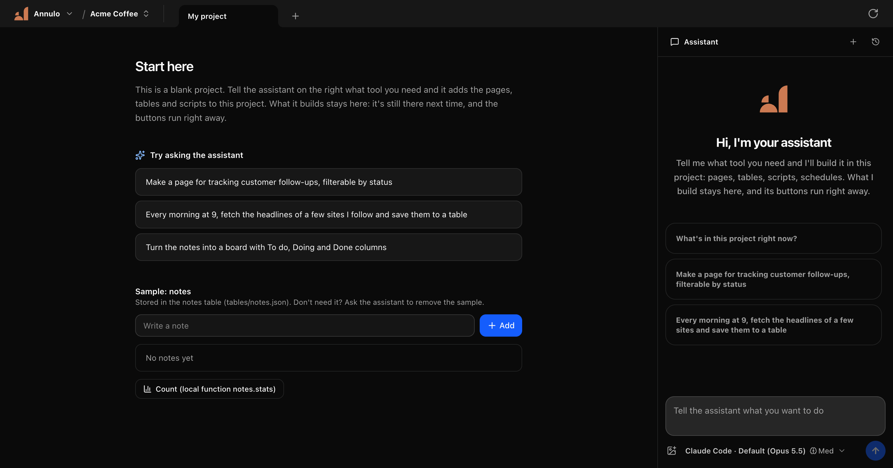
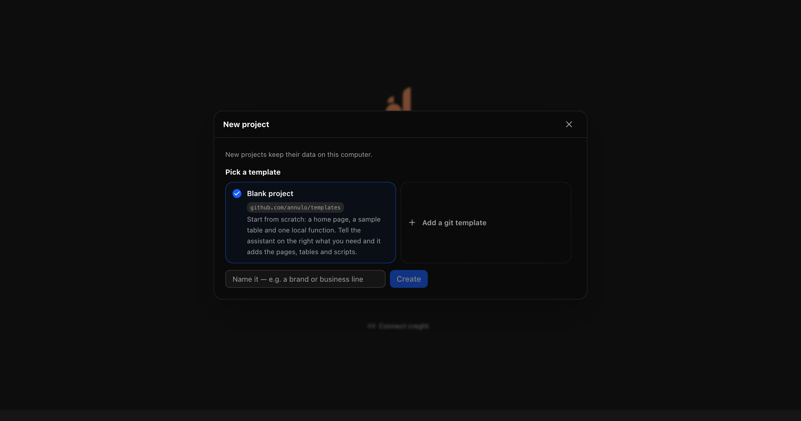
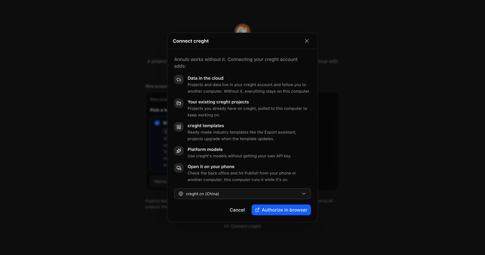

<p align="center"></p>

<h1 align="center">Annulo</h1>

<p align="center"><b>A stash for what AI builds you.</b></p>

AI is great at making things: a page, a script, a little tool, in a few sentences. Then the chat ends and the thing is gone. The page lived in a conversation, the script sits in your Downloads and won't run next week, the cloud app can't see the files and accounts on your computer.

Annulo is a desktop app where what AI builds for you **stays**. Tell the assistant what you need; it builds it into a project on your computer, and from then on it's just there, ready to use.

<p align="center"></p>

- **It runs without the AI.** The scripts the assistant writes sit behind buttons and schedules. Click and they run, with no tokens and the same result every time.
- **Everything shares one place.** Pages and scripts read and write the same tables, so the dashboard you make today can use the data you collected yesterday.
- **It's on your computer.** Local files, the sites you're already signed in to in the browser, your command-line tools: things a cloud AI can't reach, and your data stays with you.
- **It keeps getting better.** Every turn is a git commit, so a bad change is one click away from undone. Projects start from templates and keep upgrading with them; your own changes, everything under `user/`, are never overwritten.
- **Your model, your choice.** Your own API key, or Claude Code / Codex on this computer.

## How it compares

| | What it gives you |
|---|---|
| Claude Code / Codex | A craftsman: writes the code, then you have to run and keep it. Annulo can use them as its assistant. |
| Hosting a tool on Cloudflare / GitHub Pages | A public storefront: great for sharing, but every tool is its own deployment, and it can't touch your computer. |
| Personal agents (OpenClaw, Hermes…) | An assistant that acts when you message it; each run goes through the model. |
| **Annulo** | **A workshop and a home: software that stays, runs on its own, and grows with you.** |

## Get started

Build from source (macOS or Windows; Go 1.26+, Node 22+, git):

```sh
make build        # web UI + the annulo binary in bin/
bin/annulo        # opens Annulo in your browser
make electron-mac # or electron-win: the desktop app with its own Chromium
```

New project → pick a template. [`annulo/templates`](https://github.com/annulo/templates) is built in; add your own with **Add a git template**.

<table>
<tr>
<td width="50%"></td>
<td width="50%"></td>
</tr>
<tr>
<td align="center">New project: pick a template, or add your own git repo</td>
<td align="center">Connecting creght is optional: a button on the project picker, or Settings → Connections</td>
</tr>
</table>

### creght (optional)

Annulo works fully on its own. Connecting a [creght](https://creght.cn) account in Settings → Connections adds cloud storage for project data, your existing creght projects and templates, the platform's models, and opening your back office from your phone.

## Inside

| Path | What it is |
|---|---|
| `cmd/annulo` | The `annulo` command and local server (`annulo run`, `annulo push`) |
| `internal/` | Local functions runtime (`ctx.*`), tables, page rendering, schedules, project git, template upgrades, the assistant |
| `web/` | The app's UI (React) |
| `electron/` | Desktop shell for macOS and Windows |
| `third_party/pi` | The agent loop, from [Pi](https://github.com/sky-valley/pi) (MIT), with small patches |

Annulo only provides primitives; the business lives in projects (`ANNULO.md`, `pages/`, `tables/`, `local/*.ts`, `schedules/`, `tasks/`). See [AGENTS.md](AGENTS.md).

## License

[Apache-2.0](LICENSE). See [NOTICE](NOTICE) for third-party code.
